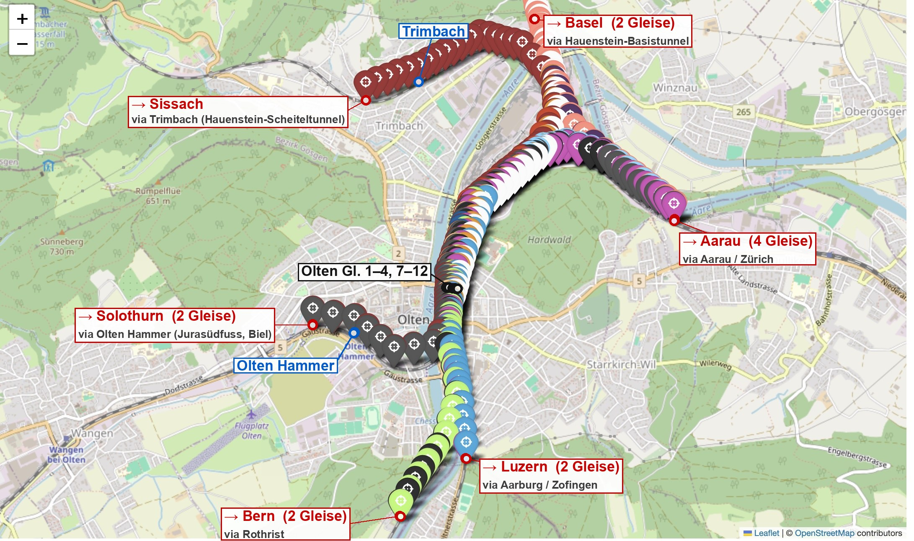

# Olten: Namen der Streckenränder prüfen

> Für eine kurze Rückfrage im Team, Stand 2026-09-25. Es geht um sechs Namen
> im Flatland-Szenario **Olten** (aus `flatland-association/flatland-scenarios`,
> MIT). Datei im Repo: `backend/app/fixtures/olten/olten.geography.json`, Herkunft
> in `backend/app/fixtures/olten/SOURCE.md`.

*Rot = Streckenränder (wohin ein Zug das Netz verlässt), blau = Zwischenhalte,
schwarz = Bahnhofsgleise. Die farbigen Pins sind die modellierten Gleise aus
dem Upstream-Repo, auf OpenStreetMap. Unsere Punkte sitzen an den echten
Koordinaten aus `position_to_latlon.pkl`.*

## Was sicher ist

- **Olten Gleis 1–4 und 7–12**, **Olten Hammer** (Gleis 2 und 4), **Trimbach**:
  so im Upstream-Notebook `scenario_olten.ipynb` benannt.

## Was wir abgeleitet haben und bitte prüfen

Das Notebook benennt die Ränder nur nach Linie und Himmelsrichtung
(`end6south`, `end10north` …). Die Ziele stammen aus den Kommentaren an den 52
Fahrplanzeilen («# Genf», «# Sissach via Trimbach» …).

| # | Rand | Unser Name | Züge, die dort fahren | Frage |
|---|---|---|---|---|
| 1 | Süd, **westlicher** (grün) | → **Bern** via Rothrist | Bern, Genf, Lausanne, Brig, Domodossola | Stimmt das? |
| 2 | Süd, **östlicher** (blau) | → **Luzern** via Aarburg / Zofingen | Luzern, Zofingen, Sursee, Langenthal, Locarno | Oder genau umgekehrt wie 1? |
| 3 | Ost, **4 Gleise** | → **Aarau** (Zürich) | Zürich, Baden, Turgi, Romanshorn, Arth-Goldau; Basel ↔ Zürich durch | Führen alle vier Richtung Aarau, oder ist eines eine Güter- oder Umfahrungslinie? |
| 4 | Nord, 2 Gleise | → **Basel** via Hauenstein-Basistunnel | Basel, von Basel | Sehr wahrscheinlich richtig |
| 5 | Nordwest | → **Sissach** via Trimbach (alte Hauensteinlinie) | Sissach via Trimbach | Sehr wahrscheinlich richtig |
| 6 | Westsüdwest, 2 Gleise | → **Solothurn** via Olten Hammer (Jurasüdfuss, Biel) | Biel via Hammer, Langendorf via Hammer | Sehr wahrscheinlich richtig |

Rand 6 umfasst zwei Gleise; eines davon (`end4south`) befährt im Szenario kein Zug.

## Rückmeldung

Pro Zeile reicht «stimmt» oder der richtige Name. Eine Korrektur ist eine Zeile
in `olten.geography.json`.
